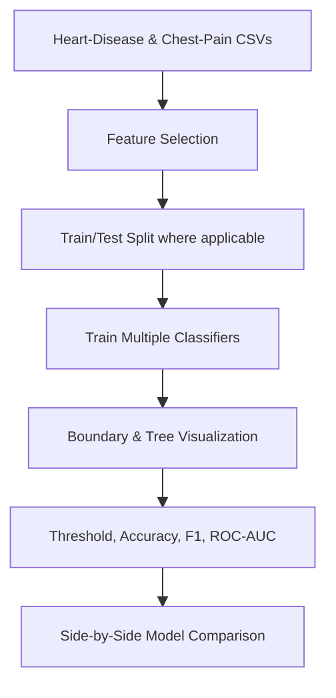
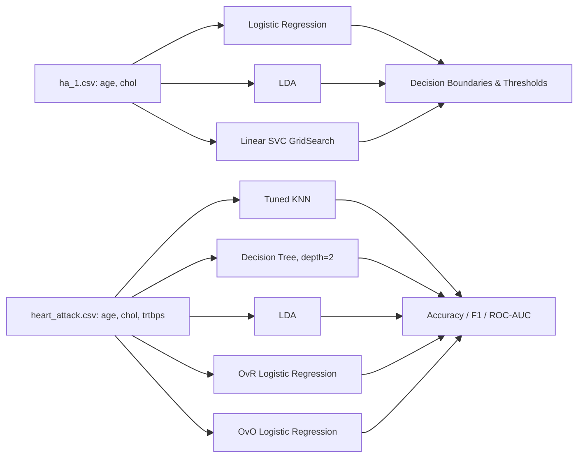
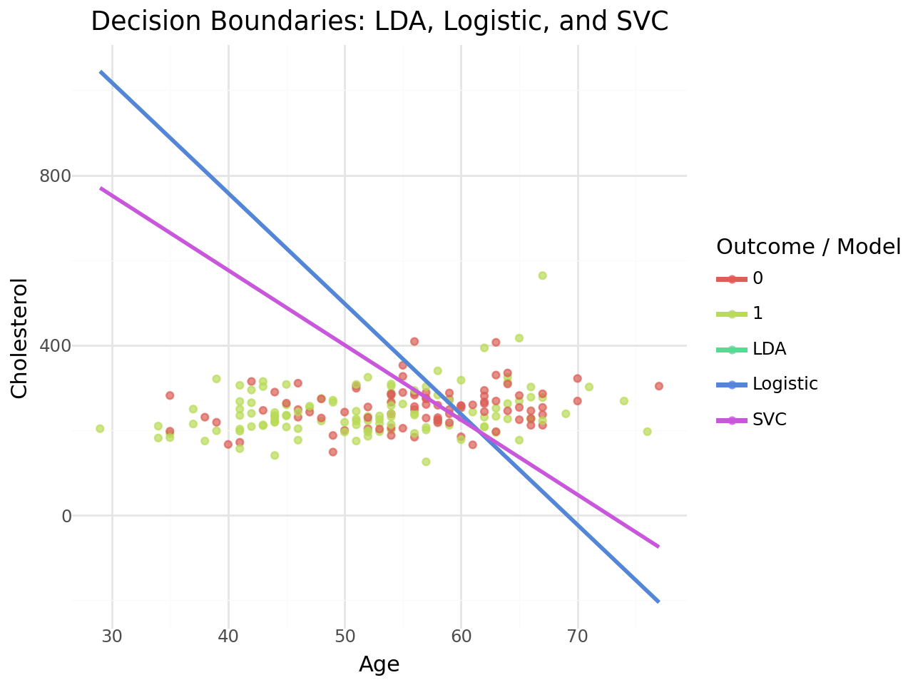
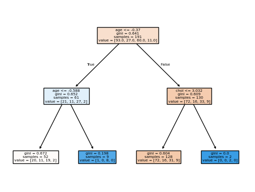

# Medical Condition Classification


---

## Overview

This repository contains two related healthcare classification projects that compare statistical and machine learning classifiers while focusing on interpretability, decision boundaries, and model evaluation.

The workflow includes:
- Heart-disease binary classification with linear classifiers in a two-feature space
- Chest-pain multiclass classification with KNN, decision tree, LDA, one-vs-rest, and one-vs-one approaches
- Visual comparison of decision boundaries and split logic
- Threshold and per-class evaluation tables

The projects are educational analyses and should not be used for clinical decision-making.

---

## Project Workflow



---

# Business Problem

Healthcare classifiers can support clinicians by surfacing patients who warrant closer review, but only if their decision behavior is transparent enough to be challenged. These notebooks lean into that constraint by sticking to interpretable, low-dimensional models whose decisions can be drawn on a 2-D plane or read off a single tree.

Accurate, interpretable healthcare classifiers can support:
- Patient triage and risk stratification
- Education of clinical staff on model behavior
- Auditing and bias review of predictive tools
- Threshold-policy design (e.g. cholesterol cutoffs at fixed ages)
- Comparative studies of statistical vs. machine learning methods

These notebooks predict heart-disease presence and chest-pain type using interpretable classifiers.

---

# Dataset

The notebooks use two healthcare datasets:

- `ha_1.csv` — cleaned heart-disease dataset for binary classification
- `heart_attack.csv` — chest-pain dataset for multiclass classification

Heart-disease features used:
- `age`
- `chol` (cholesterol)

Chest-pain features used:
- `age`, `chol`, `trtbps` (resting blood pressure)

### Target Variables
- `diagnosis` — binary heart-disease label
- `cp` — chest-pain class (`0` asymptomatic, `1` typical angina, `2` atypical angina, `3` non-anginal pain)

These are binary and multiclass classification problems.

---

# Exploratory Data Analysis (EDA)

### Key Findings
- Cholesterol and age separate the heart-disease classes reasonably well even before modeling
- Class `0` (asymptomatic) dominates the chest-pain distribution, which biases simple classifiers
- The two-feature setup makes the heart-disease decision boundary visually inspectable
- Chest-pain class boundaries are less clean — the multiclass task is fundamentally harder

---

# Data Preprocessing

The preprocessing workflow includes:

- Loading CSVs and selecting relevant predictors
- Standardizing numeric features inside the KNN, decision-tree, and LDA pipelines
- Train/test splitting (`test_size=0.3`, `random_state=321`)
- Encoding the target as integer class labels for the multiclass task

### Pipeline Components
- `pandas` for CSV loading and feature selection
- `StandardScaler` inside `ColumnTransformer` for the KNN/DT/LDA pipelines
- `Pipeline` for chaining preprocessing and model steps
- `train_test_split` and `GridSearchCV` from scikit-learn

The preprocessing layer is intentionally minimal to keep the focus on decision-boundary interpretation rather than feature engineering.

---

# Model Architecture

The two notebooks compare distinct families of classifiers.



### Training Configuration
- Heart Disease: linear classifiers in the `age`-`chol` plane; SVC tuned via `GridSearchCV` with `cv=5`
- Chest Pain: KNN tuned over `n_neighbors=1..10`, decision tree with `max_depth=2`, LDA, OvR and OvO logistic regression
- Metric Focus: cholesterol-threshold extraction (Heart Disease); accuracy, F1, ROC-AUC (Chest Pain)

---

# Model Performance

### Evaluation Metrics
- Cholesterol threshold at age 55 (decision-boundary readout)
- Accuracy
- F1 score (weighted)
- ROC-AUC (multiclass weighted OVR)
- Confusion matrix

### Project 1: Heart Disease Classification — Decision Boundaries

Each linear classifier draws a straight line in the age-cholesterol plane that splits "no disease" (red) from "disease" (green). Logistic regression and LDA produce nearly identical boundaries — both pass through roughly the same point near age 60 — while the SVC with `C=1` chooses a flatter slope, which is why its threshold at age 55 sits about 55 mg/dL below the other two.



| Model | Cholesterol Threshold at Age 55 (mg/dL) |
| --- | ---: |
| Logistic Regression | 367.87 |
| Linear Discriminant Analysis | 368.24 |
| Linear Support Vector Classifier | 312.70 |

### Project 2: Chest Pain Classification — Decision Tree Splits

The fitted decision tree (max depth 2) splits first on standardized `age`, then on `age` again on the younger branch and on `chol` on the older branch. Color intensity encodes class purity — the darker right-side leaf (128 samples, gini 0.604) collects mostly class-0 cases, while a small darker-blue leaf isolates a near-pure class-2 region.



### Combined Results Snapshot

| Notebook | Model / Analysis | Reported Result |
| --- | --- | ---: |
| `Heart_Diseases.ipynb` | Logistic regression cholesterol threshold at age 55 | 367.87 |
| `Heart_Diseases.ipynb` | LDA cholesterol threshold at age 55 | 368.24 |
| `Heart_Diseases.ipynb` | Linear SVC cholesterol threshold at age 55 | 312.70 |
| `Chest_Pain.ipynb` | KNN accuracy | 0.3293 |
| `Chest_Pain.ipynb` | KNN ROC-AUC | 0.4556 |
| `Chest_Pain.ipynb` | Decision tree accuracy | 0.4024 |
| `Chest_Pain.ipynb` | Decision tree ROC-AUC | 0.5830 |
| `Chest_Pain.ipynb` | LDA accuracy | 0.4146 |
| `Chest_Pain.ipynb` | LDA ROC-AUC | 0.5206 |
| `Chest_Pain.ipynb` | OvR F1 — class 3 (non-anginal pain, best) | 0.8386 |
| `Chest_Pain.ipynb` | OvR F1 — class 1 (typical angina) | 0.7010 |
| `Chest_Pain.ipynb` | OvR F1 — class 2 (atypical angina) | 0.6347 |
| `Chest_Pain.ipynb` | OvR F1 — class 0 (asymptomatic) | 0.4856 |
| `Chest_Pain.ipynb` | OvO ROC-AUC — class 0 vs 3 (best pair) | 0.7778 |

### Key Findings
- Logistic regression and LDA produce nearly identical heart-disease boundaries — when assumptions match, the two methods converge
- The Linear SVC trades a tighter margin for a different slope, illustrating how regularization changes thresholds
- Multiclass chest-pain accuracy stays under 50% across KNN, DT, and LDA — the problem is genuinely hard at this feature granularity
- The OvR approach distinguishes class 3 (non-anginal pain) far better than the other classes (F1 0.8386 vs 0.4856 for class 0)
- The OvO comparison between class 0 and class 3 gives the strongest pairwise ROC-AUC (0.7778)

---

# Demonstration & Applications

The notebooks demonstrate how interpretable classifiers can be compared head-to-head when the feature space is small enough to visualize.

Potential applications include:
- Teaching examples on decision boundaries
- Stepping-stone for adding more clinical features
- Comparative studies of statistical vs. ML classifiers
- Threshold-policy explorations under different cost trade-offs
- Visual model-audit material for non-technical stakeholders

---

# Technologies Used

- Python
- pandas
- NumPy
- scikit-learn
- matplotlib
- seaborn
- plotnine
- Jupyter Notebook

---

# Repository Structure

```text
medical-condition-classification/
│
├── Heart_Diseases.ipynb
├── Chest_Pain.ipynb
├── images/
│   ├── heart-decision-boundaries.png
│   └── chest-pain-decision-tree.png
└── README.md
```

---

# How to Run

1. Clone the repository
2. Add `ha_1.csv` and `heart_attack.csv` to the repository root
3. Install required dependencies
4. Open either notebook in Jupyter Notebook or Google Colab
5. Run all notebook cells sequentially

```bash
pip install pandas numpy matplotlib seaborn plotnine scikit-learn
```

---

# Future Improvements

- Add the data source citation and download instructions in a dedicated data section
- Include train/test split details and random seeds in a reproducibility table
- Add a short interpretation paragraph after each model comparison
- Expand beyond two predictors for the heart-disease classification task
- Add cross-validated scores alongside the single-split results

---

# Author

**Pranika Chandra**  
Projects focused on healthcare data classification, interpretable machine learning, and applied data science.
